# SavoyConnect User Management - ER Diagram

## Entity Relationship Diagram (3NF Normalized)

```mermaid
erDiagram
    %% Core Authentication Entity
    USERS ||--o| USER_PROFILES : "has one"
    USERS ||--o| USER_PREFERENCES : "has one"
    USERS ||--o{ USER_ADDRESSES : "has many"
    USERS ||--o{ SESSIONS : "has many"
    USERS ||--o{ PASSWORD_RESETS : "has many"
    USERS ||--o{ USER_LOGIN_HISTORY : "has many"
    USERS ||--o{ USER_ACTIVITY_LOG : "has many"
    
    %% Social Links (Many-to-Many)
    USERS ||--o{ USER_SOCIAL_LINKS : "has many"
    SOCIAL_PLATFORMS ||--o{ USER_SOCIAL_LINKS : "linked to many users"
    
    %% Interests (Many-to-Many)
    USERS ||--o{ USER_INTERESTS : "has many"
    INTERESTS ||--o{ USER_INTERESTS : "selected by many users"
    
    %% Dietary Restrictions (Many-to-Many)
    USERS ||--o{ USER_DIETARY_RESTRICTIONS : "has many"
    DIETARY_RESTRICTIONS ||--o{ USER_DIETARY_RESTRICTIONS : "applied to many users"
    
    %% Session links to Login History
    SESSIONS ||--o{ USER_LOGIN_HISTORY : "created by"
    SESSIONS ||--o{ USER_ACTIVITY_LOG : "used in"
    
    %% Entity Definitions
    USERS {
        bigint id PK
        varchar email UK "Unique"
        varchar phone UK "Unique"
        varchar password_hash
        timestamp email_verified_at
        timestamp phone_verified_at
        enum status "active, inactive, suspended, deleted"
        timestamp last_login_at
        int login_attempts
        timestamp locked_until
        timestamp created_at
        timestamp updated_at
        timestamp deleted_at "Soft delete"
    }
    
    USER_PROFILES {
        bigint id PK
        bigint user_id FK "UNIQUE - One per user"
        varchar first_name
        varchar last_name
        date date_of_birth
        enum gender
        varchar bio
        varchar profile_picture_url
        varchar occupation
        varchar company
        varchar website
        varchar city
        varchar state
        varchar country
        varchar language_code
        varchar timezone
        timestamp created_at
        timestamp updated_at
    }
    
    USER_PREFERENCES {
        bigint id PK
        bigint user_id FK "UNIQUE - One per user"
        boolean push_notifications_enabled
        boolean email_notifications_enabled
        boolean sms_notifications_enabled
        boolean marketing_emails_consent "GDPR compliant"
        timestamp marketing_consent_given_at
        varchar marketing_consent_ip
        varchar marketing_consent_source
        boolean promotional_offers_enabled
        boolean newsletter_subscription
        boolean order_updates_enabled
        boolean delivery_updates_enabled
        boolean product_recommendations_enabled
        boolean recipe_suggestions_enabled
        boolean challenge_notifications_enabled
        boolean social_activity_notifications_enabled
        boolean weekly_digest_enabled
        enum theme "light, dark, auto"
        enum font_size
        boolean high_contrast_mode
        varchar currency_code
        varchar timezone
        boolean data_sharing_consent
        timestamp data_sharing_consent_given_at
        boolean show_profile_publicly
        boolean show_activity_publicly
        timestamp created_at
        timestamp updated_at
    }
    
    USER_ADDRESSES {
        bigint id PK
        bigint user_id FK
        enum address_type "home, work, other"
        varchar label "Custom label"
        varchar recipient_name
        varchar recipient_phone
        varchar street_address
        varchar apartment_unit
        varchar landmark
        varchar area
        varchar city
        varchar state_province
        varchar postal_code
        varchar country
        decimal latitude "GPS coordinate"
        decimal longitude "GPS coordinate"
        enum geocode_accuracy
        boolean is_default
        boolean is_verified
        boolean is_deliverable
        text delivery_instructions
        timestamp last_used_at
        int usage_count
        timestamp created_at
        timestamp updated_at
        timestamp deleted_at
    }
    
    SOCIAL_PLATFORMS {
        int id PK
        varchar name UK "Facebook, Instagram, etc"
        varchar slug UK
        varchar icon_class
        varchar base_url
        boolean is_active
        int display_order
    }
    
    USER_SOCIAL_LINKS {
        bigint id PK
        bigint user_id FK
        int platform_id FK
        varchar profile_url
        varchar username
        boolean is_verified
        boolean is_public
        int display_order
        timestamp created_at
        timestamp updated_at
    }
    
    INTERESTS {
        int id PK
        varchar name UK "Cooking, Sports, etc"
        varchar slug UK
        varchar category "food, sports, entertainment"
        varchar icon
        boolean is_active
        int display_order
    }
    
    USER_INTERESTS {
        bigint id PK
        bigint user_id FK
        int interest_id FK
        enum proficiency_level "beginner, intermediate, advanced"
        timestamp created_at
    }
    
    DIETARY_RESTRICTIONS {
        int id PK
        varchar name UK "Vegetarian, Vegan, etc"
        varchar slug UK
        enum category "diet_type, allergen, intolerance"
        text description
        varchar icon
        enum severity_level "preference, moderate, severe, life_threatening"
        boolean is_active
        int display_order
    }
    
    USER_DIETARY_RESTRICTIONS {
        bigint id PK
        bigint user_id FK
        int restriction_id FK
        enum severity "preference, allergy, intolerance"
        varchar notes
        boolean diagnosed_by_doctor
        timestamp created_at
        timestamp updated_at
    }
    
    SESSIONS {
        bigint id PK
        bigint user_id FK
        varchar session_token UK
        varchar refresh_token
        varchar token_family
        enum device_type
        varchar device_name
        varchar device_id
        varchar device_fingerprint
        varchar browser_name
        varchar browser_version
        varchar operating_system
        varchar os_version
        varchar ip_address
        varchar ip_country
        varchar ip_city
        text user_agent
        boolean is_active
        timestamp last_activity_at
        timestamp expires_at
        boolean is_trusted_device
        boolean requires_2fa
        timestamp created_at
    }
    
    PASSWORD_RESETS {
        bigint id PK
        bigint user_id FK
        varchar email
        varchar token UK
        varchar token_hash_algo
        boolean is_used
        timestamp used_at
        timestamp expires_at
        varchar ip_address
        text user_agent
        enum reset_method
        int attempt_count
        timestamp last_attempt_at
        timestamp created_at
    }
    
    USER_LOGIN_HISTORY {
        bigint id PK
        bigint user_id FK
        bigint session_id FK "Nullable"
        enum login_method "password, otp, social, biometric"
        enum status "success, failed, blocked, suspicious"
        varchar failure_reason
        varchar failure_code
        varchar ip_address
        varchar ip_country
        varchar ip_city
        boolean ip_is_vpn
        int ip_risk_score
        enum device_type
        varchar device_id
        text user_agent
        varchar browser_name
        varchar operating_system
        boolean is_new_device
        boolean is_new_location
        boolean is_suspicious
        int risk_score
        timestamp created_at
    }
    
    USER_ACTIVITY_LOG {
        bigint id PK
        bigint user_id FK
        bigint session_id FK "Nullable"
        varchar activity_type "profile_updated, etc"
        enum activity_category "account, profile, security"
        varchar description
        varchar entity_type "Table name"
        bigint entity_id
        text old_value "JSON or text"
        text new_value "JSON or text"
        varchar ip_address
        text user_agent
        timestamp created_at
    }
```



---

## Relationship Summary

### **1:1 Relationships** (One-to-One)
- `USERS` → `USER_PROFILES` (Each user has exactly one profile)
- `USERS` → `USER_PREFERENCES` (Each user has exactly one preference set)

### **1:N Relationships** (One-to-Many)
- `USERS` → `USER_ADDRESSES` (User can have multiple addresses)
- `USERS` → `SESSIONS` (User can have multiple active sessions)
- `USERS` → `PASSWORD_RESETS` (User can request multiple resets)
- `USERS` → `USER_LOGIN_HISTORY` (User has many login attempts)
- `USERS` → `USER_ACTIVITY_LOG` (User performs many activities)

### **M:N Relationships** (Many-to-Many via Junction Tables)
- `USERS` ↔ `SOCIAL_PLATFORMS` (via `USER_SOCIAL_LINKS`)
  - Users can link multiple social platforms
  - Each platform can be linked by many users
  
- `USERS` ↔ `INTERESTS` (via `USER_INTERESTS`)
  - Users can have multiple interests
  - Each interest can be selected by many users
  
- `USERS` ↔ `DIETARY_RESTRICTIONS` (via `USER_DIETARY_RESTRICTIONS`)
  - Users can have multiple dietary restrictions
  - Each restriction can apply to many users

### **Supporting Relationships**
- `SESSIONS` → `USER_LOGIN_HISTORY` (Login creates session)
- `SESSIONS` → `USER_ACTIVITY_LOG` (Activities happen within sessions)

---

## Table Categories

### 🔐 **Authentication & Security** (Blue)
- `USERS` - Core authentication
- `SESSIONS` - Active sessions
- `PASSWORD_RESETS` - Password recovery
- `USER_LOGIN_HISTORY` - Authentication audit

### 👤 **User Profile** (Green)
- `USER_PROFILES` - Personal information
- `USER_PREFERENCES` - App settings

### 📍 **Location & Delivery** (Yellow)
- `USER_ADDRESSES` - Delivery addresses

### 🔗 **Social & Interests** (Purple)
- `SOCIAL_PLATFORMS` (Reference)
- `USER_SOCIAL_LINKS` (Junction)
- `INTERESTS` (Reference)
- `USER_INTERESTS` (Junction)

### 🍽️ **Dietary & Health** (Orange)
- `DIETARY_RESTRICTIONS` (Reference)
- `USER_DIETARY_RESTRICTIONS` (Junction)

### 📊 **Audit & Tracking** (Red)
- `USER_ACTIVITY_LOG` - General activities

---

## Key Design Patterns

### ✅ **Normalization Patterns Applied:**

1. **Separation of Concerns**
   - Authentication data separate from profile data
   - Settings separate from personal info
   - Audit data in dedicated tables

2. **Reference Tables + Junction Tables**
   - `SOCIAL_PLATFORMS` (reference) + `USER_SOCIAL_LINKS` (junction)
   - `INTERESTS` (reference) + `USER_INTERESTS` (junction)
   - `DIETARY_RESTRICTIONS` (reference) + `USER_DIETARY_RESTRICTIONS` (junction)

3. **Proper Foreign Keys**
   - All relationships enforced with FK constraints
   - CASCADE rules for data integrity
   - Indexes on foreign keys for performance

4. **Temporal Data Handling**
   - `SESSIONS` has expiration and last_activity tracking
   - `PASSWORD_RESETS` has expiration and usage flags
   - Soft deletes in `USERS` and `USER_ADDRESSES`

5. **Audit Trail**
   - `USER_LOGIN_HISTORY` - Never delete, complete login audit
   - `USER_ACTIVITY_LOG` - Track all significant actions
   - Timestamps on all tables

---

## Data Flow Examples

### User Registration Flow:
```
1. INSERT into USERS (email, password_hash, phone)
2. TRIGGER auto-creates USER_PROFILES row
3. TRIGGER auto-creates USER_PREFERENCES row
4. User can add USER_ADDRESSES
5. User can select INTERESTS → creates USER_INTERESTS rows
6. User can link SOCIAL_PLATFORMS → creates USER_SOCIAL_LINKS rows
7. User can set DIETARY_RESTRICTIONS → creates USER_DIETARY_RESTRICTIONS rows
```

### Login Flow:
```
1. Verify USERS credentials
2. Create SESSIONS row
3. Log to USER_LOGIN_HISTORY (status=success, session_id)
4. Reset USERS.login_attempts to 0
5. Update USERS.last_login_at
```

### Profile Update Flow:
```
1. UPDATE USER_PROFILES
2. Log to USER_ACTIVITY_LOG (activity_type='profile_updated', old_value, new_value)
```

---

## Cardinality Notation

- `||--o|` : One and only one to zero or one (1:1)
- `||--o{` : One to zero or many (1:N)
- `||--||` : One and only one to one and only one (1:1 mandatory)
- `}o--o{` : Zero or many to zero or many (M:N)

---

## How to View This Diagram

### Option 1: GitHub
- Push this file to GitHub
- GitHub renders Mermaid diagrams automatically

### Option 2: VS Code Extension
- Install "Markdown Preview Mermaid Support" extension
- Open this file and preview it (Ctrl+Shift+V)

### Option 3: Online Tools
- Copy the Mermaid code block
- Paste into: https://mermaid.live/
- Export as PNG/SVG

### Option 4: Mermaid CLI
```bash
npm install -g @mermaid-js/mermaid-cli
mmdc -i Phase1_Users_ER_Diagram.md -o Phase1_Users_ER_Diagram.png
```

---

## Database Statistics

- **Total Tables:** 17
  - Core Tables: 14
  - Reference Tables: 3 (SOCIAL_PLATFORMS, INTERESTS, DIETARY_RESTRICTIONS)
  - Junction Tables: 3 (USER_SOCIAL_LINKS, USER_INTERESTS, USER_DIETARY_RESTRICTIONS)

- **Relationships:** 14 foreign key relationships

- **Indexes:** 50+ indexes for query optimization

- **Triggers:** 5 triggers for data integrity

- **Views:** 4 materialized views for common queries

- **Stored Procedures:** 4 procedures for complex operations

---

## Normalization Verification ✅

| Normal Form | Achieved | Evidence |
|-------------|----------|----------|
| **1NF** | ✅ Yes | All columns atomic, no repeating groups, no arrays |
| **2NF** | ✅ Yes | No partial dependencies, all non-key attributes depend on entire PK |
| **3NF** | ✅ Yes | No transitive dependencies, non-key attributes depend only on PK |
| **BCNF** | ✅ Yes | Every determinant is a candidate key |

