# SavoyConnect - Complete Entity Relationship Diagram

## All Core Entities and Relationships

```mermaid
erDiagram
    %% ========================================
    %% CORE COMMERCE ENTITIES
    %% ========================================
    
    USER ||--o{ ORDER : "places"
    USER ||--o{ REVIEW : "writes"
    USER ||--o{ ADDRESS : "has"
    USER ||--o| WALLET : "owns"
    USER ||--o{ PAYMENT_METHOD : "saves"
    USER ||--o| HEALTH_PROFILE : "has"
    USER ||--o| ECO_IMPACT : "tracks"
    USER ||--o{ NOTIFICATION : "receives"
    
    PRODUCT ||--o{ ORDER_ITEM : "ordered in"
    PRODUCT }o--|| CATEGORY : "belongs to"
    PRODUCT ||--o{ REVIEW : "receives"
    PRODUCT ||--o{ INVENTORY : "stocked at"
    PRODUCT ||--o| NUTRITION : "has"
    PRODUCT ||--o{ ALLERGEN : "contains"
    PRODUCT ||--o{ IMAGE : "displays"
    
    ORDER ||--|{ ORDER_ITEM : "contains"
    ORDER ||--|| PAYMENT : "paid by"
    ORDER ||--o| DELIVERY : "fulfilled by"
    ORDER }o--|| ADDRESS : "delivered to"
    ORDER }o--o| LOCATION : "fulfilled from"
    ORDER }o--o| PROMOTION : "uses"
    
    LOCATION ||--o{ INVENTORY : "stocks"
    LOCATION ||--o{ DELIVERY_PERSONNEL : "employs"
    LOCATION ||--o{ REVIEW : "receives"
    
    DELIVERY }o--|| DELIVERY_PERSONNEL : "assigned to"
    DELIVERY ||--o{ TRACKING_EVENT : "tracked by"
    
    %% ========================================
    %% LOYALTY & ENGAGEMENT
    %% ========================================
    
    WALLET ||--o{ TRANSACTION : "records"
    WALLET }o--o{ REWARD : "redeems"
    
    USER ||--o{ CHALLENGE : "participates in"
    CHALLENGE ||--o{ COMPLETION : "completed as"
    
    USER ||--o{ BADGE : "earns"
    BADGE }o--|| BADGE_DEFINITION : "defined by"
    
    USER ||--o{ FLAVOR_TRY : "tastes"
    FLAVOR_TRY }o--|| PRODUCT : "tracks"
    
    %% ========================================
    %% CONTENT & SOCIAL
    %% ========================================
    
    RECIPE ||--o{ RECIPE_INGREDIENT : "requires"
    RECIPE ||--o{ RECIPE_STEP : "follows"
    RECIPE ||--o{ RECIPE_IMAGE : "shows"
    USER ||--o{ RECIPE : "views/saves"
    
    USER ||--o{ POST : "creates"
    POST ||--o{ LIKE : "receives"
    POST ||--o{ COMMENT : "receives"
    POST ||--o{ SHARE : "shared as"
    
    NEWS ||--|| POST : "is a type of"
    COMMUNITY_POST ||--|| POST : "is a type of"
    
    %% ========================================
    %% MARKETING & GROWTH
    %% ========================================
    
    USER ||--o{ REFERRAL : "refers"
    USER ||--o{ REFERRAL : "referred by"
    
    PROMOTION ||--o{ REDEMPTION : "redeemed as"
    USER ||--o{ REDEMPTION : "redeems"
    
    %% ========================================
    %% CUSTOMIZATION & GIFTS
    %% ========================================
    
    USER ||--o{ CUSTOM_BOX : "creates"
    CUSTOM_BOX ||--o{ CUSTOM_BOX_ITEM : "contains"
    CUSTOM_BOX_ITEM }o--|| PRODUCT : "includes"
    CUSTOM_BOX ||--o| GIFT_MESSAGE : "includes"
    
    %% ========================================
    %% GAMIFICATION
    %% ========================================
    
    USER ||--o{ GAME_SESSION : "plays"
    GAME_SESSION }o--|| GAME : "of game"
    USER ||--o{ GAME_SUBSCRIPTION : "subscribes to"
    GAME_SUBSCRIPTION }o--|| GAME : "for game"
    USER ||--o{ GAME_SCORE : "achieves"
    
    %% ========================================
    %% SUPPORT & FEEDBACK
    %% ========================================
    
    USER ||--o{ FEEDBACK : "submits"
    USER ||--o{ SUPPORT_TICKET : "creates"
    SUPPORT_TICKET ||--o{ TICKET_MESSAGE : "contains"
    
    %% ========================================
    %% AUTHENTICATION & SECURITY
    %% ========================================
    
    USER ||--o{ SESSION : "has"
    USER ||--o{ LOGIN_HISTORY : "recorded in"
    USER ||--o{ PASSWORD_RESET : "requests"
    
    %% ========================================
    %% USER PREFERENCES & PROFILE
    %% ========================================
    
    USER ||--o| PROFILE : "has"
    USER ||--o| PREFERENCES : "configures"
    USER ||--o{ SOCIAL_LINK : "links"
    USER ||--o{ INTEREST : "has"
    USER ||--o{ DIETARY_RESTRICTION : "has"
```



---

## 📊 Core Entity Details

### 🛒 **COMMERCE FLOW**
```
USER → ORDER → ORDER_ITEM → PRODUCT
  ↓       ↓
ADDRESS  PAYMENT
  ↓
DELIVERY → DELIVERY_PERSONNEL
```

### 💰 **LOYALTY FLOW**
```
USER → WALLET → TRANSACTION
  ↓       ↓
CHALLENGE REWARD
  ↓
BADGE
```

### 🍰 **CONTENT FLOW**
```
PRODUCT → RECIPE → RECIPE_INGREDIENT
  ↓                      ↓
REVIEW              RECIPE_STEP
```

### 👥 **SOCIAL FLOW**
```
USER → POST → COMMENT
  ↓      ↓       ↓
LIKE  SHARE   REPLY
```

---

## 🔗 Relationship Cardinalities

### One-to-One (1:1)
- `USER` ↔ `WALLET` (Each user has one wallet)
- `USER` ↔ `PROFILE` (Each user has one profile)
- `USER` ↔ `PREFERENCES` (Each user has one preference set)
- `USER` ↔ `HEALTH_PROFILE` (Each user has one health profile)
- `USER` ↔ `ECO_IMPACT` (Each user has one eco tracker)
- `ORDER` ↔ `PAYMENT` (Each order has one payment)
- `ORDER` ↔ `DELIVERY` (Each order has one delivery)
- `PRODUCT` ↔ `NUTRITION` (Each product has one nutrition info)
- `CUSTOM_BOX` ↔ `GIFT_MESSAGE` (Each box has one message)

### One-to-Many (1:N)
- `USER` → `ORDER` (User places many orders)
- `USER` → `REVIEW` (User writes many reviews)
- `USER` → `ADDRESS` (User has many addresses)
- `USER` → `SESSION` (User has many sessions)
- `USER` → `POST` (User creates many posts)
- `USER` → `NOTIFICATION` (User receives many notifications)
- `ORDER` → `ORDER_ITEM` (Order contains many items)
- `PRODUCT` → `ORDER_ITEM` (Product in many order items)
- `PRODUCT` → `REVIEW` (Product has many reviews)
- `LOCATION` → `INVENTORY` (Location stocks many products)
- `LOCATION` → `DELIVERY_PERSONNEL` (Location employs many drivers)
- `RECIPE` → `RECIPE_STEP` (Recipe has many steps)
- `POST` → `COMMENT` (Post has many comments)
- `POST` → `LIKE` (Post has many likes)
- `CHALLENGE` → `COMPLETION` (Challenge completed many times)

### Many-to-Many (M:N)
- `USER` ↔ `PRODUCT` (via `REVIEW`, `FLAVOR_TRY`)
- `USER` ↔ `CHALLENGE` (via `USER_CHALLENGE`)
- `USER` ↔ `BADGE` (via `USER_BADGE`)
- `USER` ↔ `RECIPE` (via `USER_RECIPE_HISTORY`)
- `USER` ↔ `PROMOTION` (via `REDEMPTION`)
- `USER` ↔ `REWARD` (via `REWARD_REDEMPTION`)
- `USER` ↔ `GAME` (via `GAME_SESSION`, `GAME_SUBSCRIPTION`)
- `USER` ↔ `INTEREST` (via `USER_INTEREST`)
- `USER` ↔ `DIETARY_RESTRICTION` (via `USER_DIETARY_RESTRICTION`)
- `PRODUCT` ↔ `LOCATION` (via `INVENTORY`)
- `PRODUCT` ↔ `CUSTOM_BOX` (via `CUSTOM_BOX_ITEM`)

---

## 🎯 Entity Dependency Hierarchy

### **Level 1: Foundation (No dependencies)**
```
- USER
- PRODUCT
- LOCATION
- CATEGORY
- GAME
- CHALLENGE
- BADGE_DEFINITION
- PROMOTION
- REWARD
- INTEREST
- DIETARY_RESTRICTION
- SOCIAL_PLATFORM
```

### **Level 2: User Extensions**
```
- PROFILE (depends on USER)
- PREFERENCES (depends on USER)
- ADDRESS (depends on USER)
- WALLET (depends on USER)
- HEALTH_PROFILE (depends on USER)
- ECO_IMPACT (depends on USER)
- SOCIAL_LINK (depends on USER, SOCIAL_PLATFORM)
- USER_INTEREST (depends on USER, INTEREST)
- USER_DIETARY_RESTRICTION (depends on USER, DIETARY_RESTRICTION)
```

### **Level 3: Product Extensions**
```
- NUTRITION (depends on PRODUCT)
- ALLERGEN (depends on PRODUCT)
- IMAGE (depends on PRODUCT)
- INVENTORY (depends on PRODUCT, LOCATION)
```

### **Level 4: Transactions**
```
- ORDER (depends on USER, ADDRESS, LOCATION)
- SESSION (depends on USER)
- PAYMENT_METHOD (depends on USER)
- CUSTOM_BOX (depends on USER)
- RECIPE (no strict dependency, but links to PRODUCT)
```

### **Level 5: Transaction Details**
```
- ORDER_ITEM (depends on ORDER, PRODUCT)
- PAYMENT (depends on ORDER, PAYMENT_METHOD)
- REVIEW (depends on USER, PRODUCT or LOCATION)
- DELIVERY (depends on ORDER)
- CUSTOM_BOX_ITEM (depends on CUSTOM_BOX, PRODUCT)
```

### **Level 6: Fulfillment & Tracking**
```
- DELIVERY_PERSONNEL (depends on LOCATION)
- TRACKING_EVENT (depends on DELIVERY)
- TRANSACTION (depends on WALLET)
- REDEMPTION (depends on USER, PROMOTION)
```

### **Level 7: Engagement & Content**
```
- POST (depends on USER)
- RECIPE_INGREDIENT (depends on RECIPE)
- RECIPE_STEP (depends on RECIPE)
- USER_CHALLENGE (depends on USER, CHALLENGE)
- GAME_SESSION (depends on USER, GAME)
- BADGE (depends on USER, BADGE_DEFINITION)
- FLAVOR_TRY (depends on USER, PRODUCT)
```

### **Level 8: Social Interactions**
```
- COMMENT (depends on POST, USER)
- LIKE (depends on POST, USER)
- SHARE (depends on POST, USER)
- CHALLENGE_COMPLETION (depends on USER_CHALLENGE)
- GAME_SCORE (depends on GAME_SESSION)
```

---

## 🔐 Critical Foreign Key Relationships

### **USER as Hub (Central Entity)**
```sql
-- USER connects to:
user_profiles.user_id → users.id
user_preferences.user_id → users.id
user_addresses.user_id → users.id
wallet_accounts.user_id → users.id
orders.user_id → users.id
reviews.user_id → users.id
sessions.user_id → users.id
community_posts.user_id → users.id
user_challenges.user_id → users.id
user_badges.user_id → users.id
... (20+ foreign keys to USER)
```

### **PRODUCT as Hub**
```sql
-- PRODUCT connects to:
order_items.product_id → products.id
product_nutrition.product_id → products.id
product_images.product_id → products.id
product_allergens.product_id → products.id
location_inventory.product_id → products.id
product_reviews.product_id → products.id
flavor_tries.product_id → products.id
custom_box_items.product_id → products.id
```

### **ORDER as Transaction Hub**
```sql
-- ORDER connects to:
order_items.order_id → orders.id
payments.order_id → orders.id
deliveries.order_id → orders.id
order_status_history.order_id → orders.id
```

---

## 📈 Data Flow Examples

### **1. Complete Order Flow**
```
┌─────┐     ┌───────┐     ┌────────────┐     ┌─────────┐
│USER │────→│ORDER  │────→│ORDER_ITEM  │────→│PRODUCT  │
└─────┘     └───────┘     └────────────┘     └─────────┘
              │   │              │                  │
              │   │              └─────────┐        │
              │   ↓                        ↓        ↓
              │ ┌─────────┐          ┌──────────────────┐
              │ │PAYMENT  │          │Check INVENTORY   │
              │ └─────────┘          │at LOCATION       │
              │                      └──────────────────┘
              ↓
         ┌─────────┐     ┌──────────────────┐
         │DELIVERY │────→│DELIVERY_PERSONNEL│
         └─────────┘     └──────────────────┘
              │
              ↓
         ┌──────────────────┐
         │TRACKING_EVENT    │
         │(GPS updates)     │
         └──────────────────┘
```

### **2. Loyalty Reward Flow**
```
┌─────┐     ┌────────────┐     ┌─────────────┐
│USER │────→│CHALLENGE   │────→│COMPLETION   │
└─────┘     └────────────┘     └─────────────┘
   │              │                    │
   │              └────────────────────┘
   ↓                                   ↓
┌────────┐                        ┌─────────────┐
│WALLET  │←───────────────────────│TRANSACTION  │
└────────┘                        │(+IceCoins)  │
   │                              └─────────────┘
   ↓
┌────────────────┐     ┌───────────────┐
│REWARD_REDEMPTION│────→│LOYALTY_REWARD │
└────────────────┘     └───────────────┘
```

### **3. Social Content Flow**
```
┌─────┐     ┌──────────────┐
│USER │────→│COMMUNITY_POST│
└─────┘     └──────────────┘
   │              │
   │              ├────→ ┌─────────┐
   │              │      │LIKE     │
   │              │      └─────────┘
   │              │
   │              ├────→ ┌─────────┐
   │              │      │COMMENT  │
   │              │      └─────────┘
   │              │
   │              └────→ ┌─────────┐
   │                     │SHARE    │
   │                     └─────────┘
   │
   └────→ ┌──────────┐
          │NEWS_POST │
          └──────────┘
```

---

## 🎨 Visual Legend

### Relationship Types
- `||--o|` One and only one to zero or one (1:0..1)
- `||--||` One and only one to one and only one (1:1)
- `||--o{` One to zero or many (1:N)
- `}o--o{` Zero or many to zero or many (M:N)

### Entity Colors (Conceptual)
- 🔵 **Blue:** Core Commerce (USER, PRODUCT, ORDER)
- 🟢 **Green:** Engagement (WALLET, CHALLENGE, BADGE)
- 🟡 **Yellow:** Content (RECIPE, POST)
- 🟠 **Orange:** Marketing (PROMOTION, REFERRAL)
- 🔴 **Red:** Support (FEEDBACK, TICKET)
- ⚪ **Gray:** Infrastructure (SESSION, NOTIFICATION)

---

## 📊 Entity Count Summary

| Category | Count | Entities |
|----------|-------|----------|
| **Core Commerce** | 6 | USER, PRODUCT, ORDER, PAYMENT, LOCATION, DELIVERY |
| **Loyalty & Engagement** | 4 | WALLET, CHALLENGE, BADGE, REVIEW |
| **Content & Social** | 3 | RECIPE, POST, NEWS |
| **Marketing** | 2 | PROMOTION, REFERRAL |
| **Customization** | 1 | CUSTOM_BOX |
| **Gamification** | 1 | GAME |
| **Support** | 2 | FEEDBACK, SUPPORT_TICKET |
| **Health & Sustainability** | 2 | HEALTH_PROFILE, ECO_IMPACT |
| **Infrastructure** | 3 | SESSION, NOTIFICATION, PASSWORD_RESET |
| **User Profile Extensions** | 4 | PROFILE, PREFERENCES, ADDRESS, SOCIAL_LINK |
| **Total Core Entities** | **20** | |
| **Total Physical Tables** | **80+** | (Including junction & detail tables) |

---

## 🚀 How to View This Diagram

### Option 1: Mermaid Live Editor
1. Copy the entire Mermaid code block (between triple backticks)
2. Go to: https://mermaid.live/
3. Paste and view the interactive diagram
4. Export as PNG or SVG

### Option 2: VS Code
1. Install "Markdown Preview Mermaid Support" extension
2. Open this file in VS Code
3. Press `Ctrl+Shift+V` to preview
4. Zoom and navigate the diagram

### Option 3: GitHub
1. Push this file to GitHub repository
2. View the `.md` file on GitHub
3. Diagram renders automatically

### Option 4: Generate Image
```bash
npm install -g @mermaid-js/mermaid-cli
mmdc -i SavoyConnect_Complete_ER_Diagram.md -o diagram.png -w 3000 -H 2000
```

---

## 📝 Notes

- This diagram shows **conceptual entities**, not physical tables
- Each entity may be implemented as multiple normalized tables
- Junction tables (M:N relationships) are implicit
- Some complex relationships simplified for clarity
- Audit tables (history, logs) not shown to reduce clutter

---

**Total Entities:** 20 core business concepts  
**Total Relationships:** 60+ connections  
**Normalization:** All entities follow 3NF principles  
**Schema Files:** See `Phase1_Users_Normalized.sql` for detailed implementation

