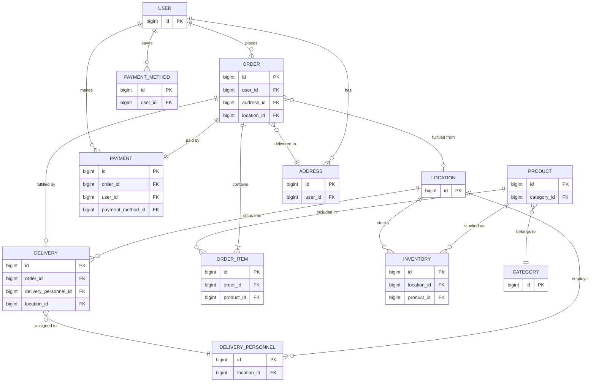

# SavoyConnect - Core 6 Entities ER Diagram

## Entity Relationship Diagram (PK & FK Only)



---

## 🎯 Core 6 Entities - Key Relationships

### **1. USER** (Central Hub)
```
PK: id
```
**Relationships:**
- USER → ORDER (1:N) - User places many orders
- USER → PAYMENT (1:N) - User makes many payments
- USER → ADDRESS (1:N) - User has many delivery addresses
- USER → PAYMENT_METHOD (1:N) - User saves payment methods

---

### **2. PRODUCT** (Catalog)
```
PK: id
FK: category_id → CATEGORY.id
```
**Relationships:**
- PRODUCT → CATEGORY (N:1) - Product belongs to one category
- PRODUCT ↔ ORDER (M:N via ORDER_ITEM) - Product in many orders
- PRODUCT ↔ LOCATION (M:N via INVENTORY) - Product stocked at locations

---

### **3. ORDER** (Transaction Core)
```
PK: id
FK: user_id → USER.id
FK: address_id → ADDRESS.id
FK: location_id → LOCATION.id (nullable - fulfillment location)
```
**Relationships:**
- ORDER → USER (N:1) - Order belongs to one user
- ORDER → ADDRESS (N:1) - Order delivered to one address
- ORDER → LOCATION (N:0..1) - Order fulfilled from location (optional)
- ORDER → ORDER_ITEM (1:N) - Order contains many items
- ORDER → PAYMENT (1:1) - Order has one payment
- ORDER → DELIVERY (1:0..1) - Order may have delivery

---

### **4. PAYMENT** (Financial Transaction)
```
PK: id
FK: order_id → ORDER.id (UNIQUE)
FK: user_id → USER.id
FK: payment_method_id → PAYMENT_METHOD.id (nullable)
```
**Relationships:**
- PAYMENT → ORDER (1:1) - Payment for one order
- PAYMENT → USER (N:1) - Payment made by one user
- PAYMENT → PAYMENT_METHOD (N:0..1) - Payment uses saved method (optional)

---

### **5. LOCATION** (Store/Warehouse)
```
PK: id
```
**Relationships:**
- LOCATION → ORDER (1:N) - Location fulfills many orders
- LOCATION → DELIVERY (1:N) - Location ships many deliveries
- LOCATION ↔ PRODUCT (M:N via INVENTORY) - Location stocks products
- LOCATION → DELIVERY_PERSONNEL (1:N) - Location employs drivers

---

### **6. DELIVERY** (Fulfillment)
```
PK: id
FK: order_id → ORDER.id (UNIQUE)
FK: delivery_personnel_id → DELIVERY_PERSONNEL.id (nullable)
FK: location_id → LOCATION.id
```
**Relationships:**
- DELIVERY → ORDER (1:1) - Delivery for one order
- DELIVERY → DELIVERY_PERSONNEL (N:0..1) - Delivery assigned to driver
- DELIVERY → LOCATION (N:1) - Delivery ships from location

---

## 🔗 Foreign Key Reference Table

| Entity | Foreign Key | References | Cardinality | Constraint |
|--------|-------------|------------|-------------|------------|
| **PRODUCT** | category_id | CATEGORY.id | N:1 | ON DELETE RESTRICT |
| **ORDER** | user_id | USER.id | N:1 | ON DELETE RESTRICT |
| **ORDER** | address_id | ADDRESS.id | N:1 | ON DELETE RESTRICT |
| **ORDER** | location_id | LOCATION.id | N:0..1 | ON DELETE SET NULL |
| **PAYMENT** | order_id | ORDER.id | 1:1 | ON DELETE CASCADE, UNIQUE |
| **PAYMENT** | user_id | USER.id | N:1 | ON DELETE RESTRICT |
| **PAYMENT** | payment_method_id | PAYMENT_METHOD.id | N:0..1 | ON DELETE SET NULL |
| **DELIVERY** | order_id | ORDER.id | 1:1 | ON DELETE CASCADE, UNIQUE |
| **DELIVERY** | delivery_personnel_id | DELIVERY_PERSONNEL.id | N:0..1 | ON DELETE SET NULL |
| **DELIVERY** | location_id | LOCATION.id | N:1 | ON DELETE RESTRICT |
| **ORDER_ITEM** | order_id | ORDER.id | N:1 | ON DELETE CASCADE |
| **ORDER_ITEM** | product_id | PRODUCT.id | N:1 | ON DELETE RESTRICT |
| **INVENTORY** | location_id | LOCATION.id | N:1 | ON DELETE CASCADE |
| **INVENTORY** | product_id | PRODUCT.id | N:1 | ON DELETE CASCADE |
| **ADDRESS** | user_id | USER.id | N:1 | ON DELETE CASCADE |
| **PAYMENT_METHOD** | user_id | USER.id | N:1 | ON DELETE CASCADE |
| **DELIVERY_PERSONNEL** | location_id | LOCATION.id | N:1 | ON DELETE RESTRICT |

---

## 📊 Complete E-Commerce Flow

```
┌──────────────────────────────────────────────────────────────┐
│                     USER (Customer)                          │
│                     PK: id                                   │
└──────────┬────────────────────┬──────────────────────────────┘
           │                    │
           ↓                    ↓
    ┌─────────────┐      ┌──────────────┐
    │  ADDRESS    │      │PAYMENT_METHOD│
    │  PK: id     │      │  PK: id      │
    │  FK: user_id│      │  FK: user_id │
    └──────┬──────┘      └──────┬───────┘
           │                    │
           └────────┬───────────┘
                    ↓
            ┌───────────────────────┐
            │       ORDER           │
            │       PK: id          │
            │       FK: user_id     │
            │       FK: address_id  │
            │       FK: location_id │
            └──┬─────────────────┬──┘
               │                 │
      ┌────────┴──────┐   ┌─────┴────────┐
      ↓               ↓   ↓              ↓
┌──────────┐   ┌──────────┐   ┌──────────────┐
│ PAYMENT  │   │ORDER_ITEM│   │   DELIVERY   │
│ PK: id   │   │ PK: id   │   │   PK: id     │
│FK:order_id│   │FK:order_id│   │ FK: order_id│
│FK:user_id│   │FK:product_id│  │FK:location_id│
└──────────┘   └────┬─────┘   │FK:personnel_id│
                    │         └──────────────┘
                    ↓
            ┌───────────────┐
            │   PRODUCT     │
            │   PK: id      │
            │FK:category_id │
            └───────┬───────┘
                    │
                    ↓
            ┌───────────────┐
            │  INVENTORY    │
            │   PK: id      │
            │FK:product_id  │
            │FK:location_id │
            └───────┬───────┘
                    │
                    ↓
            ┌───────────────┐
            │   LOCATION    │
            │   PK: id      │
            └───────────────┘
```

---

## 🎯 Key Observations

### **One-to-One Relationships**
- ORDER ↔ PAYMENT (one order = one payment)
- ORDER ↔ DELIVERY (one order = one delivery, optional)

### **One-to-Many Relationships**
- USER → ORDER
- USER → PAYMENT
- USER → ADDRESS
- LOCATION → DELIVERY
- LOCATION → DELIVERY_PERSONNEL
- ORDER → ORDER_ITEM
- PRODUCT → ORDER_ITEM

### **Many-to-Many Relationships**
- PRODUCT ↔ ORDER (via ORDER_ITEM junction table)
- PRODUCT ↔ LOCATION (via INVENTORY junction table)

---

## 🔐 Referential Integrity Rules

### **CASCADE on DELETE**
- `payments.order_id` → When order deleted, payment deleted
- `deliveries.order_id` → When order deleted, delivery deleted
- `order_items.order_id` → When order deleted, all items deleted
- `addresses.user_id` → When user deleted, addresses deleted
- `inventory.location_id` → When location deleted, inventory records deleted

### **RESTRICT on DELETE**
- `orders.user_id` → Cannot delete user with existing orders
- `orders.address_id` → Cannot delete address used in orders
- `payments.user_id` → Cannot delete user with payment history
- `order_items.product_id` → Cannot delete product in existing orders
- `deliveries.location_id` → Cannot delete location with active deliveries

### **SET NULL on DELETE**
- `orders.location_id` → When location deleted, set to NULL
- `payments.payment_method_id` → When payment method deleted, set to NULL
- `deliveries.delivery_personnel_id` → When personnel deleted, set to NULL

---

## 📝 SQL Snippet - Core FK Definitions

```sql
-- ORDER table foreign keys
ALTER TABLE orders
    ADD CONSTRAINT fk_order_user 
        FOREIGN KEY (user_id) REFERENCES users(id) 
        ON DELETE RESTRICT ON UPDATE CASCADE,
    ADD CONSTRAINT fk_order_address 
        FOREIGN KEY (address_id) REFERENCES user_addresses(id) 
        ON DELETE RESTRICT ON UPDATE CASCADE,
    ADD CONSTRAINT fk_order_location 
        FOREIGN KEY (location_id) REFERENCES locations(id) 
        ON DELETE SET NULL ON UPDATE CASCADE;

-- PAYMENT table foreign keys
ALTER TABLE payments
    ADD CONSTRAINT fk_payment_order 
        FOREIGN KEY (order_id) REFERENCES orders(id) 
        ON DELETE CASCADE ON UPDATE CASCADE,
    ADD CONSTRAINT fk_payment_user 
        FOREIGN KEY (user_id) REFERENCES users(id) 
        ON DELETE RESTRICT ON UPDATE CASCADE;

-- DELIVERY table foreign keys
ALTER TABLE deliveries
    ADD CONSTRAINT fk_delivery_order 
        FOREIGN KEY (order_id) REFERENCES orders(id) 
        ON DELETE CASCADE ON UPDATE CASCADE,
    ADD CONSTRAINT fk_delivery_location 
        FOREIGN KEY (location_id) REFERENCES locations(id) 
        ON DELETE RESTRICT ON UPDATE CASCADE,
    ADD CONSTRAINT fk_delivery_personnel 
        FOREIGN KEY (delivery_personnel_id) REFERENCES delivery_personnel(id) 
        ON DELETE SET NULL ON UPDATE CASCADE;

-- ORDER_ITEM junction table
ALTER TABLE order_items
    ADD CONSTRAINT fk_order_item_order 
        FOREIGN KEY (order_id) REFERENCES orders(id) 
        ON DELETE CASCADE ON UPDATE CASCADE,
    ADD CONSTRAINT fk_order_item_product 
        FOREIGN KEY (product_id) REFERENCES products(id) 
        ON DELETE RESTRICT ON UPDATE CASCADE;

-- INVENTORY junction table
ALTER TABLE location_inventory
    ADD CONSTRAINT fk_inventory_location 
        FOREIGN KEY (location_id) REFERENCES locations(id) 
        ON DELETE CASCADE ON UPDATE CASCADE,
    ADD CONSTRAINT fk_inventory_product 
        FOREIGN KEY (product_id) REFERENCES products(id) 
        ON DELETE CASCADE ON UPDATE CASCADE;
```

---

## 🚀 How to View

1. **Mermaid Live**: Copy diagram code → https://mermaid.live/
2. **VS Code**: Press `Ctrl+Shift+V` to preview
3. **GitHub**: Auto-renders in markdown files

---

**Last Updated:** November 12, 2025  
**Entities Shown:** 6 core + 6 supporting (12 total)  
**Foreign Keys:** 17 relationships documented  
**Normalization:** 3NF compliant

