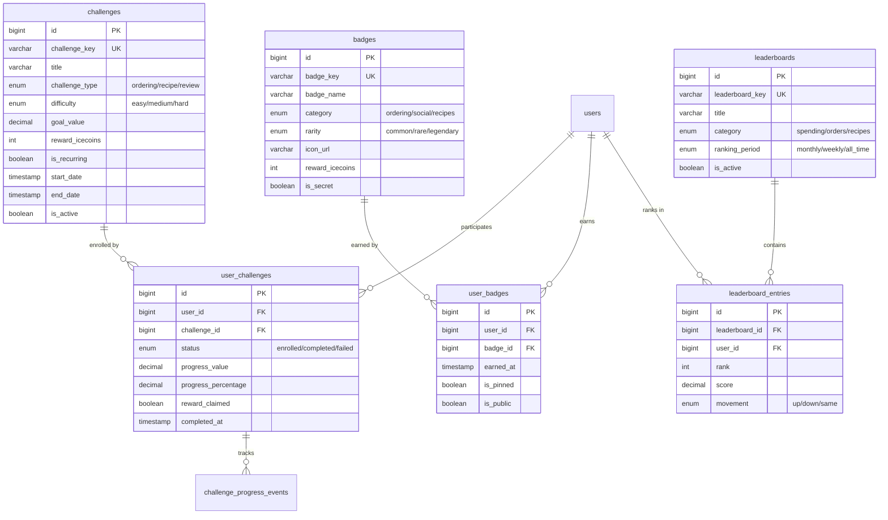

# SavoyConnect Database - Detailed ER Diagrams by Section

## Table of Contents
1. [User Management](#user-management)
2. [Product Catalog](#product-catalog)
3. [Order & Payment](#order--payment)
4. [Delivery System](#delivery-system)
5. [Loyalty & Rewards](#loyalty--rewards)
6. [Reviews & Ratings](#reviews--ratings)
7. [Recipes Platform](#recipes-platform)
8. [Social Features](#social-features)
9. [Gamification](#gamification)
10. [Analytics](#analytics)

---

## User Management

---

## Product Catalog

---

## Order & Payment

---

## Delivery System

---

## Loyalty & Rewards

---

## Reviews & Ratings

```mermaid
erDiagram
    users ||--o{ reviews : writes
    products ||--o{ reviews : "reviewed on"
    orders ||--o{ reviews : "verified by"
    reviews ||--o{ review_responses : "has response"
    reviews ||--o{ review_votes : "voted on"
    users ||--o{ review_votes : votes

    reviews {
        bigint id PK
        bigint user_id FK "→ users.id"
        bigint product_id FK "→ products.id"
        bigint order_id FK "→ orders.id"
        decimal rating "1.00 - 5.00"
        varchar title
        text comment
        json photos "Review images"
        boolean verified_purchase
        boolean is_featured
        int helpful_count
        enum status "pending/approved/rejected"
        timestamp created_at
    }

    review_responses {
        bigint id PK
        bigint review_id FK
        bigint responder_id FK
        enum responder_type "brand/admin"
        text response
        boolean is_official
    }

    review_votes {
        bigint id PK
        bigint review_id FK
        bigint user_id FK
        enum vote_type "helpful/not_helpful"
    }
```

---

## Recipes Platform

---

## Social Features

---

## Gamification

---

## Analytics

---

## Digital Passport & Sustainability

---

## Promotions & Referrals

---

## Administration

---

## Summary Statistics

| Category | Tables | Key Features |
|----------|--------|--------------|
| **User Management** | 7 | Authentication, profiles, addresses, sessions |
| **Products** | 5 | Catalog, categories, nutrition, allergens |
| **Orders** | 9 | Orders, payments, delivery, tracking |
| **Loyalty** | 7 | IceCoins, rewards, tiers, challenges |
| **Social** | 8 | Posts, follows, likes, comments |
| **Recipes** | 5 | Creation, tries, saves, collections |
| **Gamification** | 6 | Badges, challenges, leaderboards |
| **Analytics** | 8 | Page views, search, cart, conversion |
| **Digital Trust** | 5 | Passports, sustainability, verification |
| **Admin** | 10 | Roles, logs, API management |
| **System** | 10 | Files, webhooks, errors, jobs |
| **TOTAL** | **80** | Complete e-commerce ecosystem |

---

*Last Updated: November 11, 2025*  
*Database: MySQL 8.0+ | Character Set: utf8mb4*
