# SavoyConnect - Eagle Level ER Diagram
## Complete Entity Relationship Diagram (PK & FK Only)

```mermaid
erDiagram
    ORGANIZATION {
        bigint id PK
    }
    
    LOCATION {
        bigint id PK
        bigint organization_id FK
    }
    
    EMPLOYEE {
        bigint id PK
        bigint organization_id FK
    }
    
    PRODUCT {
        bigint id PK
        bigint organization_id FK
    }
    
    RETAILER {
        bigint id PK
        bigint organization_id FK
        bigint location_id FK
    }
    
    GALLERY {
        bigint id PK
        bigint organization_id FK
        bigint created_by_employee_id FK
    }
    
    CONSUMER {
        bigint id PK
        bigint organization_id FK
    }
    
    %% Junction Tables for M:N Relationships
    
    LOCATION_EMPLOYEES {
        bigint location_id FK
        bigint employee_id FK
    }
    
    LOCATION_INVENTORY {
        bigint id PK
        bigint location_id FK
        bigint product_id FK
    }
    
    EMPLOYEE_RETAILERS {
        bigint employee_id FK
        bigint retailer_id FK
    }
    
    RETAILER_PRODUCTS {
        bigint id PK
        bigint retailer_id FK
        bigint product_id FK
    }
    
    GALLERY_PRODUCTS {
        bigint gallery_id FK
        bigint product_id FK
    }
    
    CONSUMER_LOCATIONS {
        bigint consumer_id FK
        bigint location_id FK
    }
    
    CONSUMER_PRODUCTS {
        bigint id PK
        bigint consumer_id FK
        bigint product_id FK
    }
    
    RETAILER_CONSUMERS {
        bigint id PK
        bigint retailer_id FK
        bigint consumer_id FK
    }
    
    GALLERY_VIEWS {
        bigint id PK
        bigint gallery_id FK
        bigint consumer_id FK
    }
    
    EMPLOYEE_CONSUMERS {
        bigint id PK
        bigint employee_id FK
        bigint consumer_id FK
    }
    
    %% ============================================
    %% ORGANIZATION Relationships (1:*)
    %% ============================================
    
    ORGANIZATION ||--o{ LOCATION : "owns"
    ORGANIZATION ||--o{ EMPLOYEE : "employs"
    ORGANIZATION ||--o{ PRODUCT : "manufactures"
    ORGANIZATION ||--o{ RETAILER : "partners with"
    ORGANIZATION ||--o{ GALLERY : "owns content"
    ORGANIZATION ||--o{ CONSUMER : "serves"
    
    %% ============================================
    %% LOCATION Relationships
    %% ============================================
    
    LOCATION ||--o{ RETAILER : "supplies"
    LOCATION ||--o{ LOCATION_EMPLOYEES : "has staff"
    LOCATION ||--o{ LOCATION_INVENTORY : "stocks"
    LOCATION ||--o{ CONSUMER_LOCATIONS : "serves"
    
    %% ============================================
    %% EMPLOYEE Relationships
    %% ============================================
    
    EMPLOYEE ||--o{ GALLERY : "creates"
    EMPLOYEE ||--o{ LOCATION_EMPLOYEES : "works at"
    EMPLOYEE ||--o{ EMPLOYEE_RETAILERS : "manages"
    EMPLOYEE ||--o{ EMPLOYEE_CONSUMERS : "serves"
    
    %% ============================================
    %% PRODUCT Relationships
    %% ============================================
    
    PRODUCT ||--o{ LOCATION_INVENTORY : "stocked as"
    PRODUCT ||--o{ RETAILER_PRODUCTS : "sold by"
    PRODUCT ||--o{ GALLERY_PRODUCTS : "featured in"
    PRODUCT ||--o{ CONSUMER_PRODUCTS : "purchased by"
    
    %% ============================================
    %% RETAILER Relationships
    %% ============================================
    
    RETAILER ||--o{ RETAILER_PRODUCTS : "sells"
    RETAILER ||--o{ EMPLOYEE_RETAILERS : "managed by"
    RETAILER ||--o{ RETAILER_CONSUMERS : "serves"
    
    %% ============================================
    %% GALLERY Relationships
    %% ============================================
    
    GALLERY ||--o{ GALLERY_PRODUCTS : "showcases"
    GALLERY ||--o{ GALLERY_VIEWS : "viewed by"
    
    %% ============================================
    %% CONSUMER Relationships
    %% ============================================
    
    CONSUMER ||--o{ CONSUMER_LOCATIONS : "orders from"
    CONSUMER ||--o{ CONSUMER_PRODUCTS : "purchases"
    CONSUMER ||--o{ RETAILER_CONSUMERS : "shops at"
    CONSUMER ||--o{ GALLERY_VIEWS : "views"
    CONSUMER ||--o{ EMPLOYEE_CONSUMERS : "served by"
```



---

## 📊 Entity Summary

### **Core Entities (7)**

| Entity | Primary Key | Foreign Keys | Description |
|--------|-------------|--------------|-------------|
| **ORGANIZATION** | `id` | - | The company (Savoy) |
| **LOCATION** | `id` | `organization_id` | Stores, depots, warehouses |
| **EMPLOYEE** | `id` | `organization_id` | Staff, drivers, managers |
| **PRODUCT** | `id` | `organization_id` | Ice cream products |
| **RETAILER** | `id` | `organization_id`, `location_id` | Business partners |
| **GALLERY** | `id` | `organization_id`, `created_by_employee_id` | Marketing content |
| **CONSUMER** | `id` | `organization_id` | End customers |

### **Junction Tables (10)**

| Junction Table | Purpose | Foreign Keys |
|----------------|---------|--------------|
| **LOCATION_EMPLOYEES** | Employee works at multiple locations | `location_id`, `employee_id` |
| **LOCATION_INVENTORY** | Products stocked at locations | `location_id`, `product_id` |
| **EMPLOYEE_RETAILERS** | Employees manage retailers | `employee_id`, `retailer_id` |
| **RETAILER_PRODUCTS** | Retailers sell products | `retailer_id`, `product_id` |
| **GALLERY_PRODUCTS** | Gallery showcases products | `gallery_id`, `product_id` |
| **CONSUMER_LOCATIONS** | Consumers order from locations | `consumer_id`, `location_id` |
| **CONSUMER_PRODUCTS** | Consumers purchase products | `consumer_id`, `product_id` |
| **RETAILER_CONSUMERS** | Retailers serve consumers | `retailer_id`, `consumer_id` |
| **GALLERY_VIEWS** | Consumers view gallery | `gallery_id`, `consumer_id` |
| **EMPLOYEE_CONSUMERS** | Employees serve consumers | `employee_id`, `consumer_id` |

---

## 🔗 Relationship Types Summary

### **1:N Relationships (Direct Foreign Keys)**

```sql
-- ORGANIZATION as hub (1:*)
ORGANIZATION → LOCATION       (1:N)
ORGANIZATION → EMPLOYEE       (1:N)
ORGANIZATION → PRODUCT        (1:N)
ORGANIZATION → RETAILER       (1:N)
ORGANIZATION → GALLERY        (1:N)
ORGANIZATION → CONSUMER       (1:N)

-- Other 1:N relationships
LOCATION → RETAILER           (1:N)  -- retailers.location_id
EMPLOYEE → GALLERY            (1:N)  -- gallery.created_by_employee_id
```

### **M:N Relationships (Junction Tables)**

```sql
LOCATION ↔ EMPLOYEE           (M:N)  via location_employees
LOCATION ↔ PRODUCT            (M:N)  via location_inventory
LOCATION ↔ CONSUMER           (M:N)  via consumer_locations

EMPLOYEE ↔ RETAILER           (M:N)  via employee_retailers
EMPLOYEE ↔ CONSUMER           (M:N)  via employee_consumers

PRODUCT ↔ RETAILER            (M:N)  via retailer_products
PRODUCT ↔ GALLERY             (M:N)  via gallery_products
PRODUCT ↔ CONSUMER            (M:N)  via consumer_products

RETAILER ↔ CONSUMER           (M:N)  via retailer_consumers

GALLERY ↔ CONSUMER            (M:N)  via gallery_views
```

---

## 🎯 Key Relationships Explained

### **1. ORGANIZATION (Central Hub)**
```
ORGANIZATION (1) ──→ (N) LOCATION
ORGANIZATION (1) ──→ (N) EMPLOYEE
ORGANIZATION (1) ──→ (N) PRODUCT
ORGANIZATION (1) ──→ (N) RETAILER
ORGANIZATION (1) ──→ (N) GALLERY
ORGANIZATION (1) ──→ (N) CONSUMER
```
**All entities belong to one organization (multi-tenant ready)**

---

### **2. LOCATION (Distribution Hub)**
```
LOCATION (1) ──→ (N) RETAILER
    (Each retailer supplied by one location)

LOCATION (M) ←─→ (N) EMPLOYEE
    (Employees work at multiple locations)
    Junction: location_employees

LOCATION (M) ←─→ (N) PRODUCT
    (Locations stock multiple products)
    Junction: location_inventory

LOCATION (M) ←─→ (N) CONSUMER
    (Consumers order from multiple locations)
    Junction: consumer_locations
```

---

### **3. EMPLOYEE (Workforce)**
```
EMPLOYEE (1) ──→ (N) GALLERY
    (Employees create gallery content)
    gallery.created_by_employee_id FK

EMPLOYEE (M) ←─→ (N) LOCATION
    (Work at multiple locations)
    Junction: location_employees

EMPLOYEE (M) ←─→ (N) RETAILER
    (Manage multiple retailer accounts)
    Junction: employee_retailers

EMPLOYEE (M) ←─→ (N) CONSUMER
    (Serve multiple customers)
    Junction: employee_consumers
```

---

### **4. PRODUCT (Catalog)**
```
PRODUCT (M) ←─→ (N) LOCATION
    (Stocked at multiple locations)
    Junction: location_inventory

PRODUCT (M) ←─→ (N) RETAILER
    (Sold by multiple retailers)
    Junction: retailer_products

PRODUCT (M) ←─→ (N) GALLERY
    (Featured in multiple gallery items)
    Junction: gallery_products

PRODUCT (M) ←─→ (N) CONSUMER
    (Purchased by multiple consumers)
    Junction: consumer_products
```

---

### **5. RETAILER (B2B Partners)**
```
RETAILER (N) ──→ (1) LOCATION
    (Supplied by one location)
    retailers.location_id FK

RETAILER (M) ←─→ (N) EMPLOYEE
    (Managed by multiple employees)
    Junction: employee_retailers

RETAILER (M) ←─→ (N) PRODUCT
    (Sells multiple products)
    Junction: retailer_products

RETAILER (M) ←─→ (N) CONSUMER
    (Serves multiple consumers)
    Junction: retailer_consumers
```

---

### **6. GALLERY (Marketing)**
```
GALLERY (N) ──→ (1) EMPLOYEE
    (Created by one employee)
    gallery.created_by_employee_id FK

GALLERY (M) ←─→ (N) PRODUCT
    (Showcases multiple products)
    Junction: gallery_products

GALLERY (M) ←─→ (N) CONSUMER
    (Viewed by multiple consumers)
    Junction: gallery_views
```

---

### **7. CONSUMER (Customers)**
```
CONSUMER (M) ←─→ (N) LOCATION
    (Orders from multiple locations)
    Junction: consumer_locations

CONSUMER (M) ←─→ (N) EMPLOYEE
    (Served by multiple employees)
    Junction: employee_consumers

CONSUMER (M) ←─→ (N) PRODUCT
    (Purchases multiple products)
    Junction: consumer_products

CONSUMER (M) ←─→ (N) RETAILER
    (Shops at multiple retailers)
    Junction: retailer_consumers

CONSUMER (M) ←─→ (N) GALLERY
    (Views multiple gallery items)
    Junction: gallery_views
```

---

## 📐 Cardinality Reference

### **Symbols Used:**
- `1:*` or `1:N` = One-to-Many
- `*:*` or `M:N` = Many-to-Many
- `*:1` or `N:1` = Many-to-One
- `||--o{` = One to zero or many
- `}o--o{` = Many to many

### **Foreign Key Constraints:**
```sql
-- 1:N relationships use direct FK
ALTER TABLE locations 
    ADD CONSTRAINT fk_location_org 
    FOREIGN KEY (organization_id) REFERENCES organizations(id);

-- M:N relationships use junction tables
CREATE TABLE location_employees (
    location_id BIGINT REFERENCES locations(id),
    employee_id BIGINT REFERENCES employees(id),
    PRIMARY KEY (location_id, employee_id)
);
```

---

## 🚀 How to View This Diagram

### **Option 1: Mermaid Live Editor**
1. Copy the entire mermaid code block
2. Go to: https://mermaid.live/
3. Paste and view interactive diagram
4. Export as PNG/SVG

### **Option 2: VS Code**
1. Install "Markdown Preview Mermaid Support" extension
2. Open this file
3. Press `Ctrl+Shift+V` to preview

### **Option 3: GitHub**
1. Push this file to GitHub
2. View directly (auto-renders)

---

## 📊 Database Statistics

| Metric | Count |
|--------|-------|
| **Core Entities** | 7 |
| **Junction Tables** | 10 |
| **Total Tables** | 17 |
| **Foreign Keys** | 28+ |
| **1:N Relationships** | 8 |
| **M:N Relationships** | 10 |

---

**Created:** November 19, 2025  
**Schema:** SavoyConnect Eagle Level  
**Normalization:** 3NF Compliant  
**Multi-tenant:** Yes (via organization_id)

